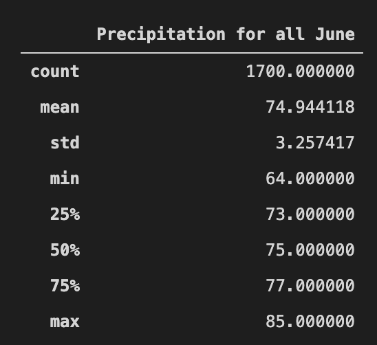
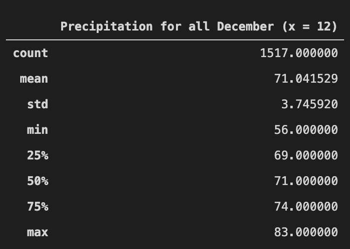
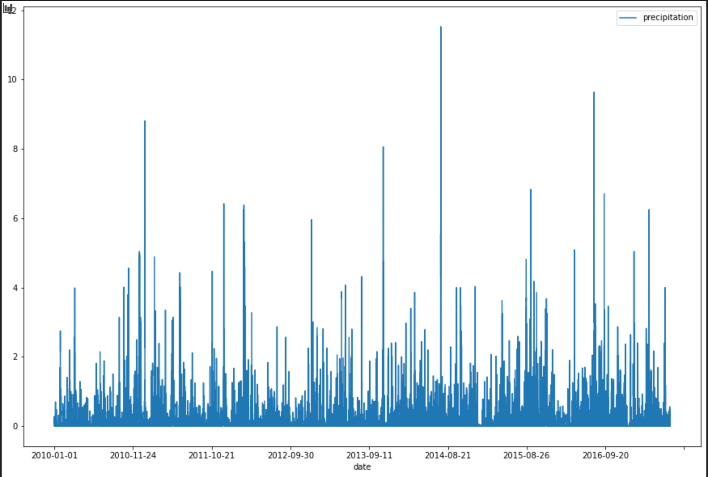
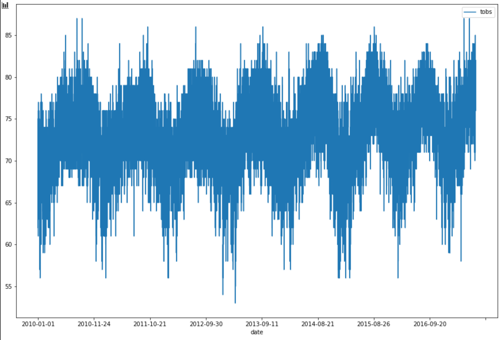

# Surf Up - Project Overview

The goal of this project was to give insights on the temperature historical trends for the months of June and December only in Oahu. The goal of this analysis is to evaluate the year-round sustainability of a surf and ice cream shop business and provide insights for investors.

## Resources

- Datasets: hawaii.sqlite (Database)
- Software: Python 3.8.5, Jupyter 6.1.4 and Flask 1.1.2 under the virtual machine "source venv/bin/activate"

## Summary

Starting from 2010 to 2017, we can present a summary for all Junes and December aggregated.

### Summary for June

Figure 1: Statistics for June aggregated



The aggregation for this period show us a low around 64, a maximum around 85 and a mean of 75 accross all year.

### Summary for December

Figure 2: Statistics for December aggregated



The aggregation for this period show us a low around 56, a maximum around 83 and a mean of 71 accross all year.

### Conclusion

The difference between June and December is noticeable, but still promising for a business operating in this area since the water isn't frozen and the ice cream lover can still go out and buy their favorite food.

## Analysis

Two additionnal queries helps us to make a better decision.

### Additional information

Figure 3: Chart for all precipitation



```
# Additional Query for June
#
#
#
#
station_6_prep = session.query(Measurement.station, Measurement.prcp).filter(extract('month', Measurement.date)==6).group_by(Measurement.station).all()
station_6_prep_df = list(station_6_prep)
#print(results_month6)

query_4 = pd.DataFrame(station_6_prep_df, columns=['Station','Precipitation for all June']) # Create DF
query_4.set_index(query_4['Station'], inplace=True) # Set Index
query_4=query_4[['Precipitation for all June']]
query_4.head(5)
```

The Figure 3 give us a visual impression that on average we can except a day below 6mm of precipitation and some day over during the summer (mostly August).

The file SurfsUp_Challenge show us:

- For June: the station USC00511918 is the lowest, but USC00517948 is the second lowest.
- For December: the station USC00514830 is the lowest, but USC00511918 is the second lowest.

Figure 4: Chart for all TOBS



```
# Additional Query for June
#
#
#
#
station_6 = session.query(Measurement.station, Measurement.tobs).filter(extract('month', Measurement.date)==6).group_by(Measurement.station).all()
station_6_df = list(station_6)

query_1 = pd.DataFrame(station_6_df, columns=['Station','TOBS for all June']) # Create DF
#query_1.set_index(query_1['Station'], inplace=True) # Set Index
#query_1=query_1[['Precipitation for all June']]
query_1.head(5)
```

The Figure 4 give us a broad visual impression that we can expect on average 72 to 76 degres and on average 3 months below and 3 months over.

The file SurfsUp_Challenge show us:

- For June: the station USC00517948 is the highest, but USC00511918 is the second highest.
- For December: the station USC00513117 is the highest, but USC00514830 is the second highest.

The latter was the lower in June which represent the summer. In conclusion, the weather seems stable with short ups and down, but the station USC00511918 records less precipitaions and a better average temperature.
